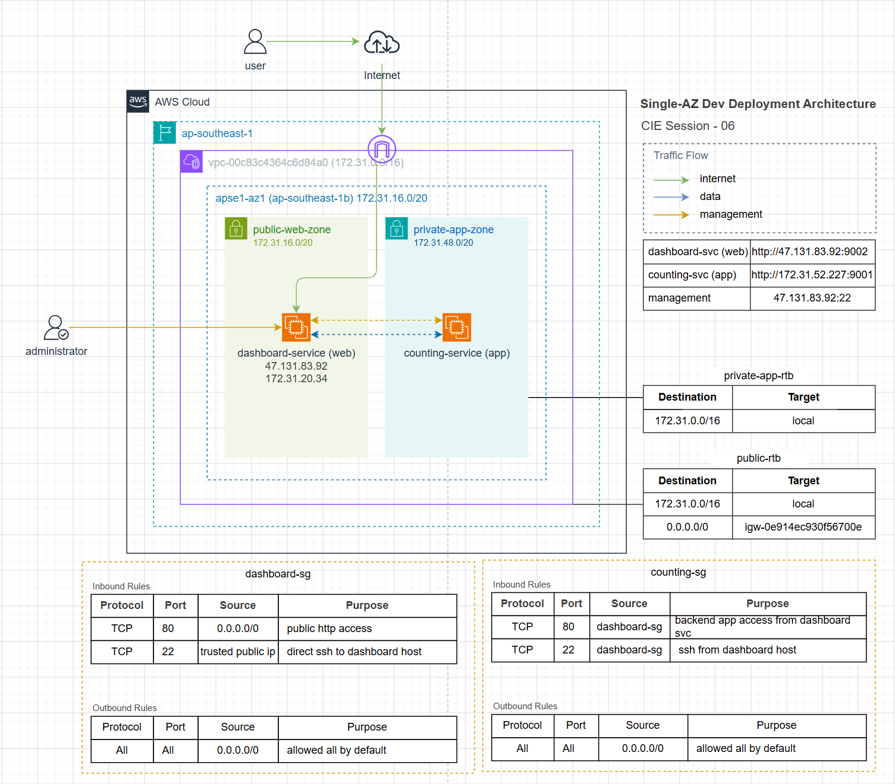
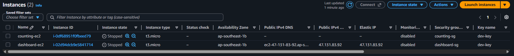
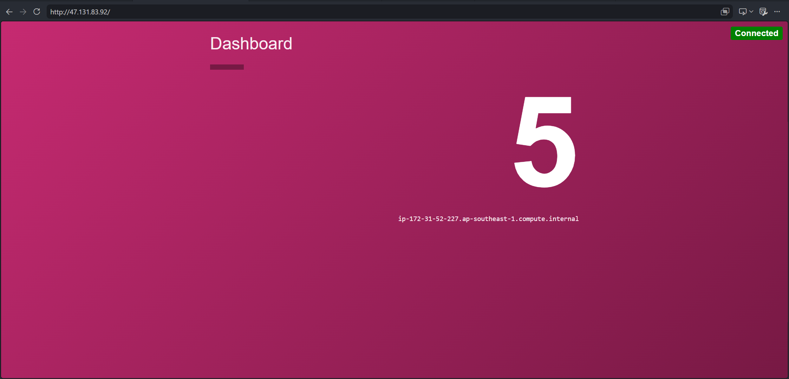
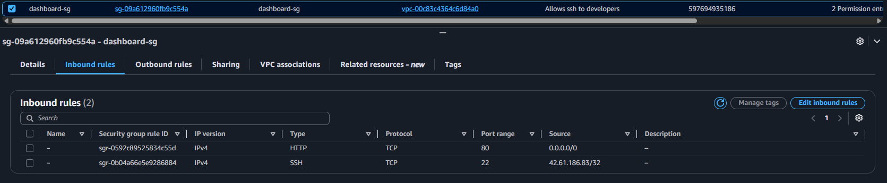
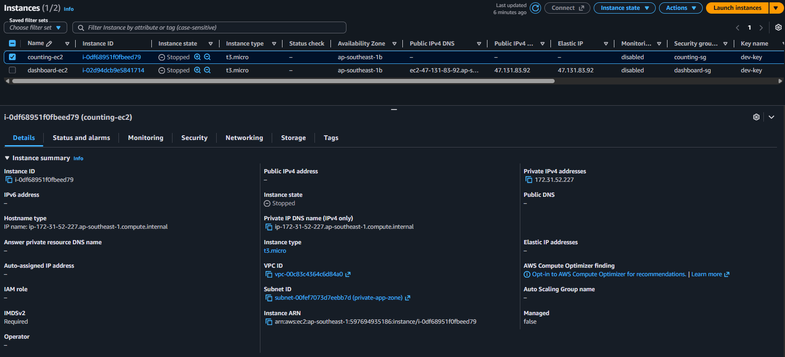
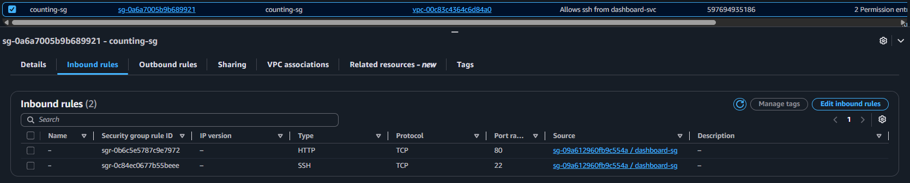

# CIE Session 06

## Lab Objective

Deploy a development environment on AWS with a secure two-tier setup:

- `Public EC2` for `dashboard-service`
- `Private EC2` for `counting-service`
- Controlled SSH access and private east-west traffic only

## Scope Implemented

- Single-AZ deployment in default VPC
- 1 public subnet and 1 private subnet
- Elastic IP attached to dashboard host
- Security groups enforcing least exposure

## Implementation Summary

1. Network foundation

- Selected default VPC and validated public subnet internet routing.
- Created private subnet in same AZ with no auto public IPv4.
- Associated private subnet to a dedicated private route table with local route only.

2. Security controls

- `dashboard-sg` inbound rules:

| Protocol | Port | Source             | Notes                 |
| -------- | ---- | ------------------ | --------------------- |
| TCP      | 80   | 0.0.0.0/0          | Public HTTP access    |
| TCP      | 22   | Trusted admin CIDR | Restricted SSH access |

- `counting-sg` inbound rules:

| Protocol | Port | Source       | Notes                              |
| -------- | ---- | ------------ | ---------------------------------- |
| TCP      | 80   | dashboard-sg | App traffic from dashboard only    |
| TCP      | 22   | dashboard-sg | SSH hop access from dashboard only |

3. Compute provisioning

- Launched `dashboard-ec2` in public subnet with public IP.
- Launched `counting-ec2` in private subnet without public IP.
- Allocated and associated Elastic IP to `dashboard-ec2`.

4. Service deployment and runtime

- Deployed `dashboard-service` and `counting-service` to respective hosts.
- Created non-root service users (`dashboard`, `counting`).
- Granted CAP_NET_BIND_SERVICE for port 80 binding without root.
- Configured dashboard-service to call counting-service via private IP.
- Created and enabled systemd units for both services.

## Validation Results

- Admin SSH to dashboard-ec2 via Elastic IP: `successful`.

- SSH from dashboard-ec2 to counting-ec2 private IP: `successful`.
- Direct public access to counting-ec2: blocked as intended.
- Dashboard endpoint reachable from browser via Elastic IP.
- Dashboard to counting service communication over private network: `successful`.

## Security Posture (Phase 1)

- SSH not exposed globally; restricted to trusted CIDR.

- Private service host has no public IP.

- `counting-service` application port reachable only from `dashboard-sg`

## Risks and Limitations

- Single-AZ design has no high availability.
- No load balancing or autoscaling.
- No private subnet outbound path via NAT.

## Next Phase: Session 07
Implement ALB and autoscaling.
