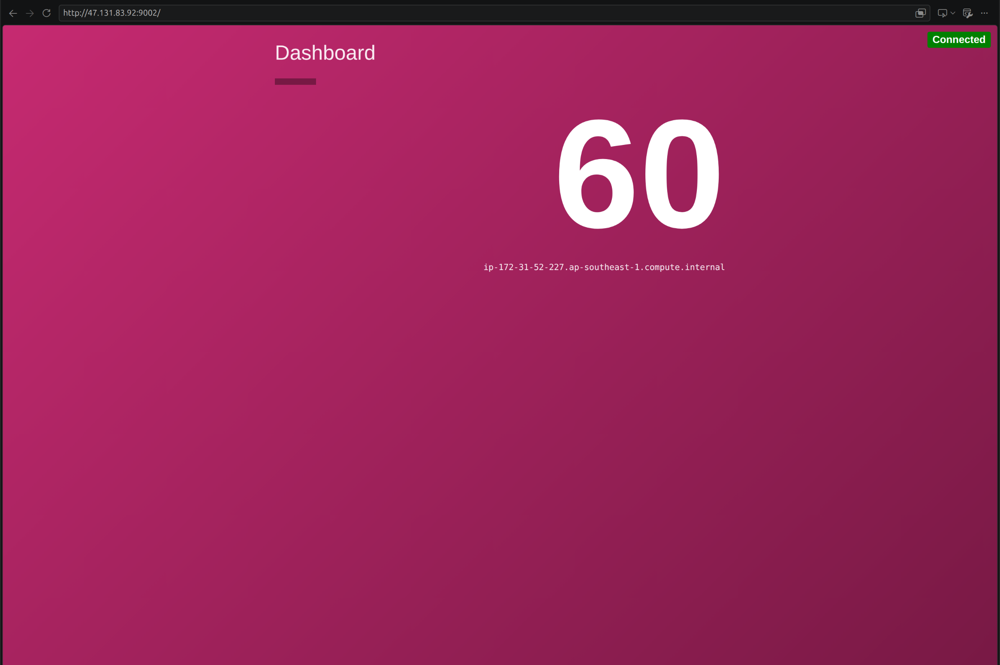

# Phase 1 Dev Deployment Guide on AWS (ClickOps)

## Scope
- Single Availability Zone development setup
- One public subnet for dashboard-service
- One private subnet for counting-service
- Direct SSH to dashboard-service from trusted public IP
- SSH hop from dashboard-service to counting-service
- No ALB, no Session Manager, no NAT in this phase
- Elastic IP on dashboard-service for stable public address

## Prerequisites
- AWS account and console access
- Correct AWS region selected
- Trusted admin source IP or CIDR known
- Service ports decided:
  - dashboard-service: port 80 (using dedicated user with CAP_NET_BIND_SERVICE)
  - counting-service: port 80 (using dedicated user with CAP_NET_BIND_SERVICE)

## Step-by-Step Deployment

### 1. Identify VPC and Existing Public Subnet
1. Open AWS Console.
2. Go to VPC.
3. Open Your VPCs.
4. Select the default VPC for the target region.
5. Go to Subnets.
6. Select one existing default subnet to use as the public subnet.

### 2. Validate Public Subnet Configuration
1. In Subnets, select the public subnet.
2. Choose Actions > Edit subnet settings.
3. Enable Auto-assign public IPv4 address.
4. Save.
5. Go to Route tables.
6. Find the route table associated with this subnet.
7. Verify route 0.0.0.0/0 points to the Internet Gateway.

### 3. Create Private Subnet
1. In VPC, go to Subnets.
2. Select Create subnet.
3. Choose the same VPC.
4. Name it private-app-subnet.
5. Pick the same AZ for simple dev.
6. Set non-overlapping CIDR, for example 172.31.100.0/24.
7. Create subnet.
8. Select the subnet, then Actions > Edit subnet settings.
9. Disable Auto-assign public IPv4 address.
10. Save.

### 4. Create and Associate Private Route Table
1. Go to Route tables.
2. Select Create route table.
3. Name it private-rt and select the VPC.
4. Create.
5. Open Subnet associations > Edit subnet associations.
6. Associate private-app-subnet.
7. Save.
8. Open Routes and keep local route only.

### 5. Create Security Groups

#### dashboard-sg
1. Go to EC2 > Security Groups > Create security group.
2. Name: dashboard-sg.
3. VPC: selected VPC.
4. Add inbound rules:
   - TCP 80 from 0.0.0.0/0
   - TCP 443 from 0.0.0.0/0 if HTTPS is used
   - TCP 22 from trusted admin CIDR only
5. Keep outbound as Allow all for dev simplicity.
6. Create.

#### counting-sg
1. Create another security group named counting-sg.
2. VPC: selected VPC.
3. Add inbound rules:
   - TCP 80 from dashboard-sg
   - TCP 22 from dashboard-sg
4. Keep outbound as Allow all for dev simplicity.
5. Create.

### 6. Create Key Pair
1. Go to EC2 > Key Pairs.
2. Select Create key pair.
3. Name it dev-key.
4. Choose PEM format.
5. Download and securely store the key.

### 7. Launch dashboard-service EC2
1. Go to EC2 > Instances > Launch instance.
2. Name: dashboard-ec2.
3. Select AMI and instance type.
4. Select key pair dev-key.
5. Network settings:
   - VPC: selected VPC
   - Subnet: selected public subnet
   - Auto-assign public IP: enabled
   - Security group: dashboard-sg
6. Launch instance.

### 8. Launch counting-service EC2
1. Launch another EC2 instance.
2. Name: counting-ec2.
3. Select AMI and instance type.
4. Select key pair dev-key.
5. Network settings:
   - VPC: selected VPC
   - Subnet: private-app-subnet
   - Auto-assign public IP: disabled
   - Security group: counting-sg
6. Launch instance.

### 9. Allocate and Associate Elastic IP
1. Go to EC2 > Elastic IPs.
2. Select Allocate Elastic IP address.
3. Allocate.
4. Select the new Elastic IP.
5. Choose Actions > Associate Elastic IP address.
6. Resource type: Instance.
7. Choose dashboard-ec2.
8. Associate.
9. Use this Elastic IP as the stable browser and SSH endpoint.

### 10. Validate Access Paths
1. SSH from admin workstation to dashboard-ec2 using Elastic IP.
`ssh -i dev-key.pem ubuntu@47.131.83.92`
2. From dashboard-ec2, SSH to counting-ec2 private IP.
`ssh -o IdentitiesOnly=yes -i /home/ubuntu/dev-key.pem ec2-user@172.31.52.227`
3. Confirm direct public SSH to counting-ec2 is not possible.

### 11. Deploy and Run Services
1. Install dependencies on both hosts.
2. Deploy dashboard-service on dashboard-ec2.
3. Deploy counting-service on counting-ec2.
4. Create dedicated users: `dashboard` on dashboard-ec2 and `counting` on counting-ec2.
5. Grant CAP_NET_BIND_SERVICE capability to each service binary to allow port 80 binding without root.
6. Configure dashboard-service to call counting-service via private IP on port 80.

### 12. Configure systemd Services
1. Create one systemd unit for dashboard-service.
```bash
[Unit]
Description=Dashboard Service
After=network-online.target
Wants=network-online.target

[Service]
Type=simple
User=dashboard
Group=dashboard
WorkingDirectory=/opt/dashboard-service
Environment=PORT=80
Environment=COUNTING_SERVICE_URL=http://172.31.52.227
ExecStart=/opt/dashboard-service/dashboard-service
Restart=on-failure
RestartSec=5

[Install]
WantedBy=multi-user.target
```

   Before enabling this unit, run:
   ```bash
   sudo setcap cap_net_bind_service=+ep /opt/dashboard-svc
   ```

2. Create one systemd unit for counting-service.
```bash
[Unit]
Description=Counting Service
After=network-online.target
Wants=network-online.target

[Service]
Type=simple
User=counting
Group=counting
WorkingDirectory=/opt/counting-service
Environment=PORT=80
ExecStart=/opt/counting-service/counting-service
Restart=on-failure
RestartSec=5

[Install]
WantedBy=multi-user.target
```

   Before enabling this unit, run:
   ```bash
   sudo setcap cap_net_bind_service=+ep /opt/counting-service/counting-service
   ```

3. Create the `dashboard` and `counting` users on their respective hosts:
   ```bash
   sudo useradd -m -s /bin/bash dashboard  # on dashboard-ec2
   sudo useradd -m -s /bin/bash counting   # on counting-ec2
   ```
4. Enable and start both services:
   ```bash
   sudo systemctl daemon-reload
   sudo systemctl enable dashboard-service
   sudo systemctl start dashboard-service
   # (repeat for counting-service on counting-ec2)
   ```
5. Validate with systemctl status and service logs.

### 13. Final Validation
1. Open dashboard endpoint in browser using Elastic IP.
2. Confirm dashboard-service calls counting-service successfully.
3. Confirm counting-service is not reachable from public internet.
4. Confirm SSH access is restricted as designed.



## Security Notes
- Do not set SSH source to 0.0.0.0/0.
- Keep counting-service private with no public IP.
- Keep counting-service app port accessible only from dashboard-sg.

## Out of Scope for This Phase
- ALB
- Auto Scaling
- Multi-AZ high availability
- Session Manager
- NAT-based private outbound internet

## Next Step
- Continue with Phase 2 in [CIE/session_06/phase2-alb-autoscaling-guide.md](CIE/session_06/phase2-alb-autoscaling-guide.md)
