# CIE Session 07

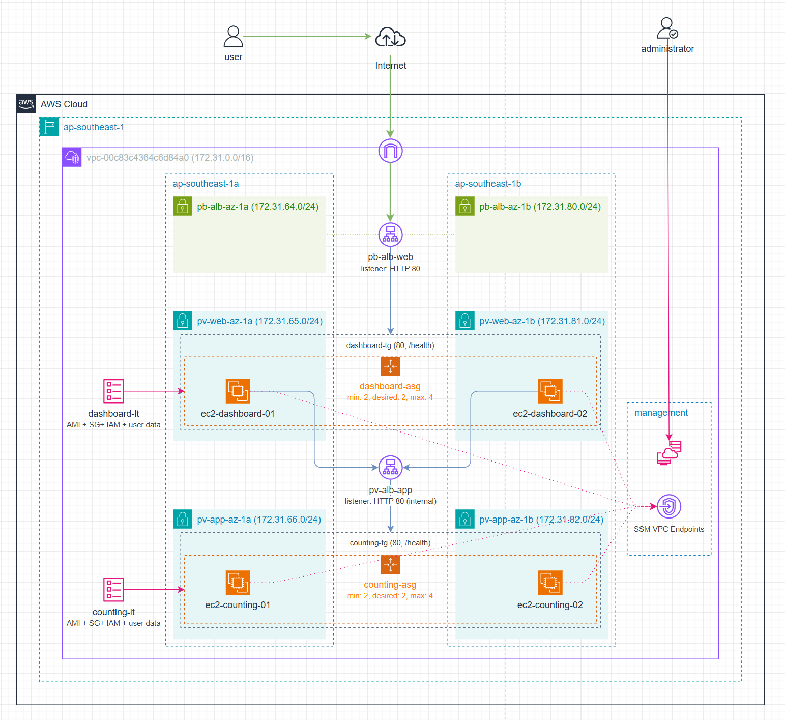

## Lab Objective

Deploy a private, multi-AZ two-tier application architecture on AWS with:

- Public entry through an internet-facing ALB for dashboard traffic
- Internal ALB for counting traffic
- Auto Scaling on both tiers
- Systems Manager (SSM) access for private instances without SSH exposure (instead of bastion jump host)

## Scope Implemented

- Region: `ap-southeast-1`
- 2 Loadbalancers:
  - 1 public facing: `pb-alb-dashboard`
    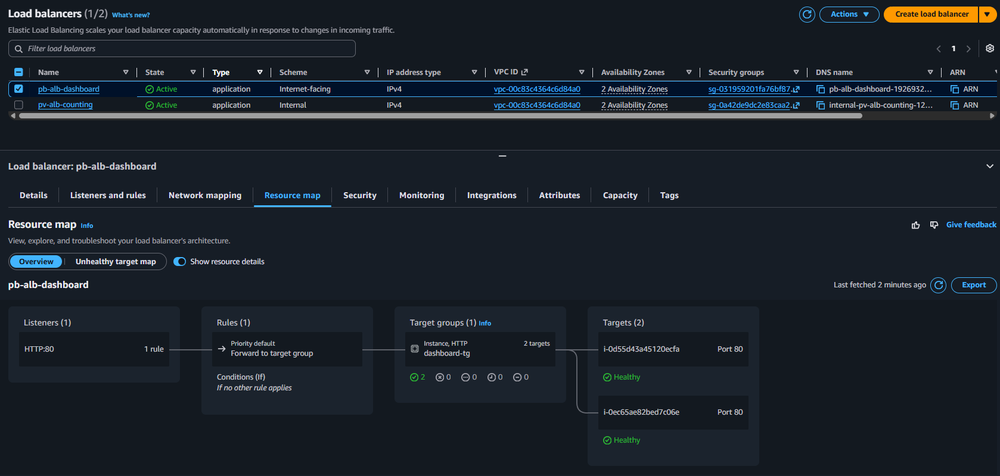
  - 1 private: `pv-alb-counting`
    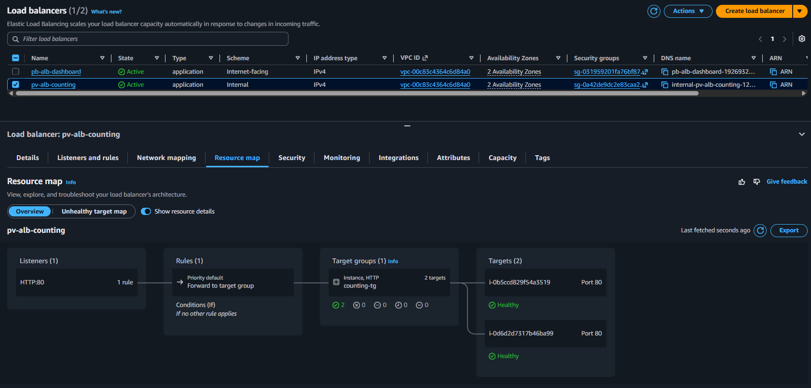

- Subnets:
  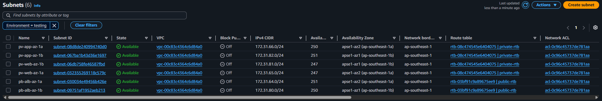
  - 2 public subnets across 2 AZs for public facing loadbalncer: `pb-alb-az-1a` `pb-alb-az-1b`
  - 2 private web subnets across 2 AZs for dashboard instances: `pv-web-az-1a` `pv-web-az-1b`
  - 2 private app subnets across 2 AZs for counting instances: `pv-app-az-1a` `pv-app-az-1b`

- 2 Auto Scaling Groups:
  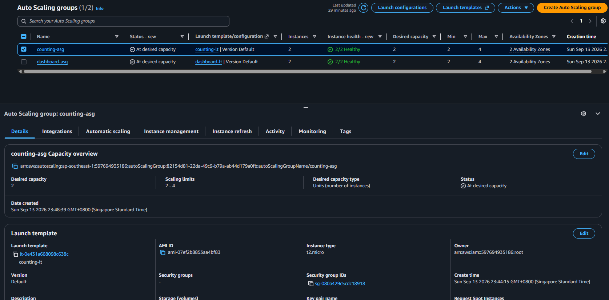
  - dashboard and counting tiers (2/2/4) `dashboard-asg` `counting-asg`

- Management Connectivity:
  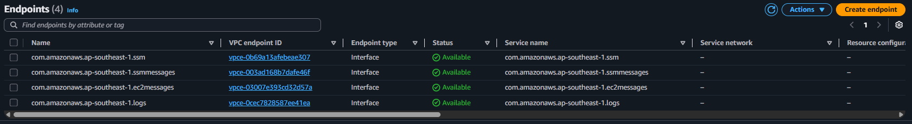
  - VPC interface endpoints for SSM, SSMMessages, and EC2Messages

## Implementation Summary

1. Network and subnet foundation

- Validated VPC and subnet layout for public ALB, private web, and private app tiers.
- Confirmed route-table separation: IGW route only for public ALB subnets; no direct IGW route for private subnets.

2. Security controls
- Implemented 5 security groups with least-privilege traffic flow.
  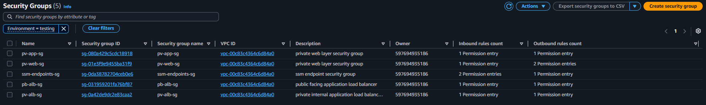

  | Category             | Security Group   | Inbound Rules                        | Outbound Rules                                   |
  | -------------------- | ---------------- | ------------------------------------ | ------------------------------------------------ |
  | Public entry         | pb-alb-sg        | TCP 80 from 0.0.0.0/0                | TCP 80 to pv-web-sg                              |
  | Dashboard tier       | pv-web-sg        | TCP 80 from pb-alb-sg                | TCP 80 to pv-alb-sg; TCP 443 to ssm-endpoints-sg |
  | Internal routing     | pv-alb-sg        | TCP 80 from pv-web-sg                | TCP 80 to pv-app-sg                              |
  | Counting tier        | pv-app-sg        | TCP 80 from pv-alb-sg                | TCP 443 to ssm-endpoints-sg                      |
  | Management endpoints | ssm-endpoints-sg | TCP 443 from pv-web-sg and pv-app-sg | All traffic (default response path)              |

3. Identity and access setup
  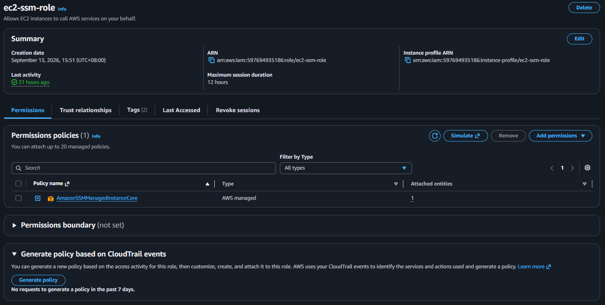
- Created EC2 IAM role/profile with AmazonSSMManagedInstanceCore.
- Attached instance profile in both launch templates.

4. Load balancing and target groups
  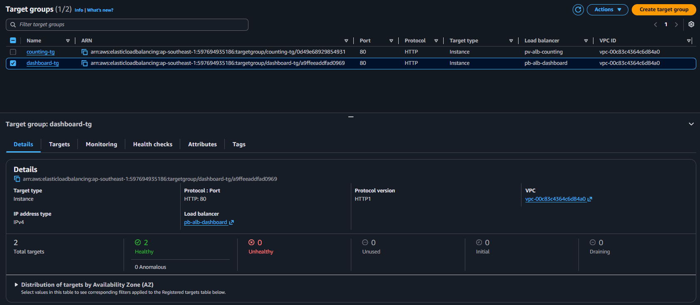
- Created dashboard target group and internet-facing ALB (HTTP 80).
- Created counting target group and internal ALB (HTTP 80).
- Standardized health checks: /health, success 200-399, deregistration delay 60s.

5. Compute and Auto Scaling
- Built dashboard and counting AMIs.
  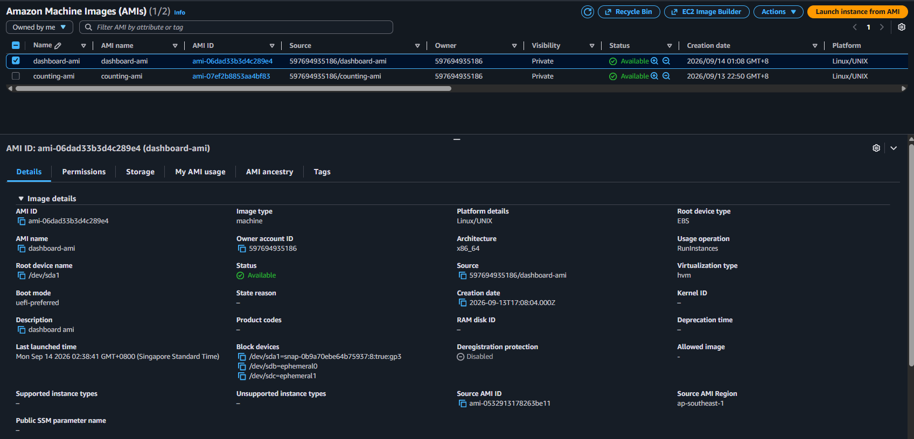
- Created launch templates (no public IP) and user data for service bootstrap.
  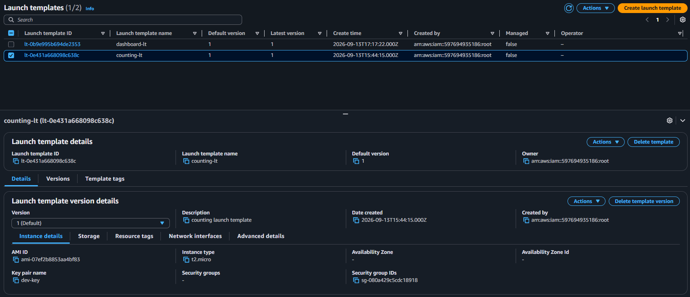
- Created `dashboard-asg` and `counting-asg` across 2 AZs with:
  
  - Desired/Min/Max: 2/2/4
  - ELB health checks
  - 180s grace period and warmup
  - Target-tracking policy at 55% CPU

6. Deployment safety
- Configured rolling update posture with launch-before-terminate and minimum healthy capacity controls.

## Validation Results
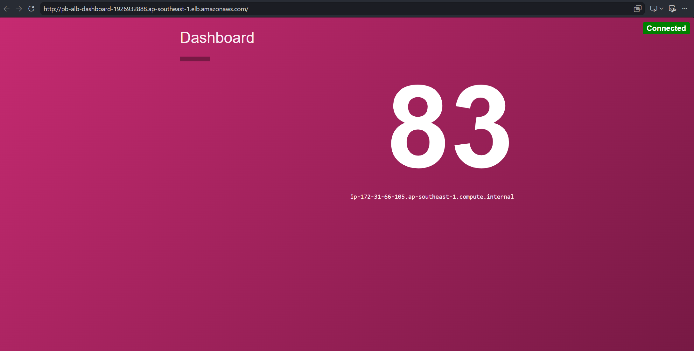
- Public ALB endpoint serves dashboard successfully.
- Dashboard and counting target groups report healthy targets.
- Both tiers are distributed across two AZs.
- Dashboard tier reaches counting tier via internal ALB.
- No private instances expose public IPs.
- Session Manager access works for private instances without inbound SSH rules.

## Security Posture (Session 07)

- No direct SSH required to private instances.
- East-west traffic constrained by SG-to-SG rules only.
- Management access routed through private SSM endpoints.
- Public exposure limited to dashboard ALB listener.

## Risks and Limitations

- Current baseline starts with HTTP listeners; HTTPS and DNS hardening are in add-on steps.
- Capacity behavior under heavy load depends on instance sizing and ASG policy tuning.
- Misconfigured health checks or warmup values can cause unnecessary instance churn.

## Next Phase: Session 08

Add on for Route 53, ACM certificates, HTTPS listeners, and HTTP-to-HTTPS redirect.
