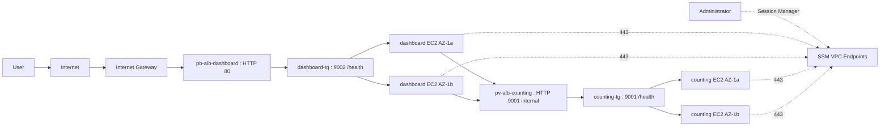

# Phase 2 Deployment Guide: Dual-ALB and Auto Scaling (ClickOps)

## Project Objective

- Internet-facing ALB for dashboard traffic
- Internal ALB for counting traffic
- Dashboard tier in private web subnets across two AZs
- Counting tier in private app subnets across two AZs
- Auto Scaling for both dashboard and counting tiers
- AWS Systems Manager (SSM) access for all private instances

## Session 08 Add-On

- Route 53 hosted zone and DNS alias routing
- ACM certificate request and validation
- HTTPS listener (443) and HTTP to HTTPS redirect

Note: Session 07 uses ALB-generated DNS names. After this add-on, switch browser checks and service URLs to the Route 53 names.

Note: For session_07, use ALB-generated DNS names for all browser checks and load tests.

## Region and Network Context

- Region: ap-southeast-1
- VPC: vpc-00c83c4364c6d84a0 (172.31.0.0/16)
- Public ALB subnets:
  - pb-alb-az-1a
  - pb-alb-az-1b
- Private web subnets (dashboard tier):
  - pv-web-az-1a
  - pv-web-az-1b
- Private app subnets (counting tier):
  - pv-app-az-1a
  - pv-app-az-1b

## Implementation Defaults

- Dashboard listener: HTTP 80 (public ALB)
- Dashboard target group: HTTP 80 (service runs as `dashboard` user)
- Counting listener: HTTP 80 (internal ALB)
- Counting target group: HTTP 80 (service runs as `counting` user)
- Health check path: /health
- Health check success codes: 200-399
- ASG desired/min/max: 2 / 2 / 4
- ASG grace period and warmup: 180 seconds
- ALB deregistration delay: 60 seconds
- Target tracking CPU: 55%
- Service binding: Uses CAP_NET_BIND_SERVICE capability (port 80 without root)

## Target Flow

1. User -> Internet -> Internet Gateway -> public ALB
2. Public ALB -> dashboard target group -> dashboard ASG instances
3. Dashboard instances -> internal counting ALB -> counting target group -> counting ASG instances
4. Administrator -> Session Manager -> SSM endpoints -> private instances



## Prerequisites

1. Confirm VPC, subnets, and IGW already exist in ap-southeast-1.
2. Confirm you either have working dashboard and counting EC2 instances to image, or you have AMIs ready, or your user data scripts fully bootstrap both services.
3. Confirm your IAM user/role has permissions for EC2, ELB, Auto Scaling, VPC endpoints, and IAM role/profile creation.

## Security Groups

### pb-alb-sg

- Inbound:
  - TCP 80 from 0.0.0.0/0
- Outbound:
  - TCP 80 to pv-web-sg

### pv-web-sg

- Inbound:
  - TCP 80 from pb-alb-sg
- Outbound:
  - TCP 80 to pv-alb-sg
  - TCP 443 to ssm-endpoints-sg

### pv-alb-sg

- Inbound:
  - TCP 80 from pv-web-sg
- Outbound:
  - TCP 80 to pv-app-sg

### pv-app-sg

- Inbound:
  - TCP 80 from pv-alb-sg
- Outbound:
  - TCP 443 to ssm-endpoints-sg

### ssm-endpoints-sg

- Inbound:
  - TCP 443 from pv-web-sg
  - TCP 443 from pv-app-sg
- Outbound:
  - Default allow-all response traffic

## Step-by-Step ClickOps Deployment

### 1. Confirm Subnet Placement and Route Tables

1. Open VPC -> Subnets.
2. Confirm subnet placement and CIDRs using this table:

| Tier                    | Subnet Name  | AZ ID     | AZ Name         | CIDR           |
| ----------------------- | ------------ | --------- | --------------- | -------------- |
| Public ALB              | pb-alb-az-1a | apse1-az2 | ap-southeast-1a | 172.31.64.0/24 |
| Public ALB              | pb-alb-az-1b | apse1-az1 | ap-southeast-1b | 172.31.80.0/24 |
| Private web (dashboard) | pv-web-az-1a | -         | ap-southeast-1a | 172.31.65.0/24 |
| Private web (dashboard) | pv-web-az-1b | -         | ap-southeast-1b | 172.31.81.0/24 |
| Private app (counting)  | pv-app-az-1a | -         | ap-southeast-1a | 172.31.66.0/24 |
| Private app (counting)  | pv-app-az-1b | -         | ap-southeast-1b | 172.31.82.0/24 |

3. Confirm the two public subnets are used only for the public ALB.
4. Confirm private web subnets are used for dashboard tier instances only.
5. Confirm private app subnets are used for counting tier instances only.
6. Overlap rule: do not create any /24 inside an existing /20 block. In this environment, avoid all address ranges within 172.31.0.0/20, 172.31.16.0/20, and 172.31.48.0/20.
7. Open VPC -> Route tables.
8. Ensure public route table has 0.0.0.0/0 -> Internet Gateway and is associated only with pb-alb-\* subnets.
9. Ensure private subnets do not have direct IGW route.

### 2. Create Security Groups

1. Open EC2 -> Security Groups.
2. Create these security groups: pb-alb-sg, pv-web-sg, pv-alb-sg, pv-app-sg, ssm-endpoints-sg.
3. Apply rules using this table:

| Security Group   | Direction | Protocol    | Port | Source or Destination |
| ---------------- | --------- | ----------- | ---- | --------------------- |
| pb-alb-sg        | Inbound   | TCP         | 80   | 0.0.0.0/0             |
| pb-alb-sg        | Outbound  | TCP         | 80   | pv-web-sg             |

| pv-web-sg        | Inbound   | TCP         | 80   | pb-alb-sg             |
| pv-web-sg        | Outbound  | TCP         | 80   | pv-alb-sg             |
| pv-web-sg        | Outbound  | TCP         | 443  | ssm-endpoints-sg      |

| pv-alb-sg        | Inbound   | TCP         | 80   | pv-web-sg             |
| pv-alb-sg        | Outbound  | TCP         | 80   | pv-app-sg             |

| pv-app-sg        | Inbound   | TCP         | 80   | pv-alb-sg             |
| pv-app-sg        | Outbound  | TCP         | 443  | ssm-endpoints-sg      |

| ssm-endpoints-sg | Inbound   | TCP         | 443  | pv-web-sg             |
| ssm-endpoints-sg | Inbound   | TCP         | 443  | pv-app-sg             |
| ssm-endpoints-sg | Outbound  | All traffic | All  | 0.0.0.0/0             |

### 3. Create IAM Role and Instance Profile for SSM

1. Open IAM -> Roles -> Create role.
2. Trusted entity: EC2.
3. Attach policy: AmazonSSMManagedInstanceCore.
4. Name role: ec2-ssm-role.
5. Open IAM -> Instance profiles.
6. Create instance profile and attach ec2-ssm-role.

### 4. Create VPC Interface Endpoints for SSM

1. Open VPC -> Endpoints -> Create endpoint.
2. Service category: Select **"AWS services"**.
3. Create interface endpoint: `com.amazonaws.ap-southeast-1.ssm`.
4. Endpoint type: Select **"Interface"**.
5. VPC: Select vpc-00c83c4364c6d84a0.
6. Subnets: Select **2 subnets only** (1 per AZ; AWS console limit):
   - pv-web-az-1a (ap-southeast-1a)
   - pv-web-az-1b (ap-southeast-1b)
7. Security group: Attach ssm-endpoints-sg.
8. Private DNS: Check **Enable private DNS name**.
9. Click **Create endpoint**.
10. Repeat steps 1-9 for:
    - com.amazonaws.ap-southeast-1.ssmmessages
    - com.amazonaws.ap-southeast-1.ec2messages
11. Optional: create com.amazonaws.ap-southeast-1.logs if you want private logging path without NAT.

### 5. Create AMIs for Dashboard and Counting

1. Open EC2 -> Instances.
2. Select the working dashboard instance.
3. Choose Actions -> Image and templates -> Create image.
4. Name the AMI `dashboard-ami` and create it.
5. Wait until the AMI status becomes `Available`.
6. Repeat steps 2-5 for the working counting instance.
7. Name the second AMI `counting-ami` and wait until it is `Available`.

### 6. Create Dashboard Target Group

1. Open EC2 -> Target Groups -> Create target group.
2. Name: dashboard-tg.
3. Target type: Instances.
4. Protocol: HTTP, Port: 80 (dashboard service running on port 80 as dedicated user).
5. VPC: vpc-00c83c4364c6d84a0.
6. Health check path: /health.
7. Success codes: 200-399.
8. Set deregistration delay to 60 seconds.

### 7. Create Internet-Facing ALB for Dashboard

1. Open EC2 -> Load Balancers -> Create Application Load Balancer.
2. Name: pb-alb-dashboard.
3. Scheme: Internet-facing.
4. IP address type: IPv4.
5. Subnets: pb-alb-az-1a and pb-alb-az-1b.
6. Security group: pb-alb-sg.
7. Listener: HTTP 80.
8. Default action: forward to dashboard-tg.

### 8. Create Counting Target Group

1. Open EC2 -> Target Groups -> Create target group.
2. Name: counting-tg.
3. Target type: Instances.
4. Protocol: HTTP, Port: 80 (counting service running on port 80 as dedicated user).
5. VPC: vpc-00c83c4364c6d84a0.
6. Health check path: /health.
7. Success codes: 200-399.
8. Set deregistration delay to 60 seconds.

### 9. Create Internal ALB for Counting

1. Open EC2 -> Load Balancers -> Create Application Load Balancer.
2. Name: pv-alb-counting.
3. Scheme: Internal.
4. IP address type: IPv4.
5. Subnets: pv-app-az-1a and pv-app-az-1b.
6. Security group: pv-alb-sg.
7. Listener: HTTP 80 (internal ALB routes to counting service on port 80).
8. Default action: forward to counting-tg.

### 10. Create Dashboard Launch Template

1. Open EC2 -> Launch Templates -> Create launch template.
2. Name: dashboard-lt.
3. Select dashboard AMI and instance type.
4. IAM instance profile: ec2-ssm-role.
5. Security group: pv-web-sg.
6. Disable public IP assignment.
7. Add user data script:

```bash
#!/bin/bash
set -e

# Create dedicated dashboard user
sudo useradd -m -s /bin/bash dashboard || true

# Point the dashboard service to the internal counting ALB created in Step 9
export COUNTING_SERVICE_URL=http://internal-pv-alb-counting-1233315600.ap-southeast-1.elb.amazonaws.com

# Grant CAP_NET_BIND_SERVICE capability to bind port 80 without root
sudo setcap cap_net_bind_service=+ep /opt/dashboard-svc

# Start dashboard service as dashboard user on port 80
sudo -u dashboard env COUNTING_SERVICE_URL="$COUNTING_SERVICE_URL" /opt/dashboard-svc --port 80 &
```

8. Replace `<internal-counting-alb-dns>` with the DNS name from Step 9 for `pv-alb-counting`.

curl -sv http://internal-pv-alb-counting-1233315600.ap-southeast-1.elb.amazonaws.com/health

### 11. Create Dashboard Auto Scaling Group

1. Open EC2 -> Auto Scaling Groups -> Create Auto Scaling group.
2. Name: dashboard-asg.
3. Launch template: dashboard-lt.
4. Subnets: pv-web-az-1a and pv-web-az-1b.
5. Attach to existing load balancer target group: dashboard-tg.
6. Desired: 2, Min: 2, Max: 4.
7. Health check type: ELB.
8. Health check grace period: 180 seconds.
9. Add target tracking scaling policy: CPU 55%.
10. Set instance warmup to 180 seconds.

### 12. Create Counting Launch Template

1. Open EC2 -> Launch Templates -> Create launch template.
2. Name: counting-lt.
3. Select counting AMI and instance type.
4. IAM instance profile: ec2-ssm-role.
5. Security group: pv-app-sg.
6. Disable public IP assignment.
7. Add user data script:

```bash
#!/bin/bash
set -e

# Create dedicated counting user
sudo useradd -m -s /bin/bash counting || true

# Grant CAP_NET_BIND_SERVICE capability to bind port 80 without root
sudo setcap cap_net_bind_service=+ep /opt/counting-svc

# Start counting service as counting user on port 80
sudo -u counting /opt/counting-svc --port 80 &
```

### 13. Create Counting Auto Scaling Group

1. Open EC2 -> Auto Scaling Groups -> Create Auto Scaling group.
2. Name: counting-asg.
3. Launch template: counting-lt.
4. Subnets: pv-app-az-1a and pv-app-az-1b.
5. Attach to existing load balancer target group: counting-tg.
6. Desired: 2, Min: 2, Max: 4.
7. Health check type: ELB.
8. Health check grace period: 180 seconds.
9. Add target tracking scaling policy: CPU 55%.
10. Set instance warmup to 180 seconds.

### 14. Configure Safe Rolling Updates

1. For both ASGs, configure instance refresh settings.
2. Use minimum healthy percentage of at least 50%.
3. Use ALB health checks as readiness gate.
4. Enable scale-in protection during deployments if your release process requires it.

Step 14 pass/fail checklist:

1. `dashboard-asg` maintenance policy is launch before terminating.
2. `dashboard-asg` minimum healthy percentage is at least 50%.
3. `dashboard-asg` health check type is ELB.
4. `dashboard-asg` instance warmup is 180 seconds.
5. `counting-asg` maintenance policy is launch before terminating.
6. `counting-asg` minimum healthy percentage is at least 50%.
7. `counting-asg` health check type is ELB.
8. `counting-asg` instance warmup is 180 seconds.
9. During replacement, each target group keeps at least one healthy target.
10. No sustained ALB or target 5XX spike appears during replacement.

Pass rule: all checks above are true.

### 15. Validate End-to-End

1. Open the public ALB DNS name in browser (not custom domain in this session).
2. Confirm dashboard response is healthy.
3. In EC2 -> Target Groups, confirm dashboard-tg targets are healthy.
4. Confirm dashboard instances are distributed across pv-web-az-1a and pv-web-az-1b.
5. Confirm counting-tg targets are healthy.
6. Confirm counting instances are distributed across pv-app-az-1a and pv-app-az-1b.
7. From a dashboard instance (via SSM), test HTTP call to internal counting ALB endpoint on port 9001.
8. Confirm no private instance has public IP.

Step 15 pass/fail checklist:

1. Public ALB endpoint returns expected dashboard response.
2. `dashboard-tg` shows healthy targets.
3. Dashboard instances are split across both web subnets.
4. `counting-tg` shows healthy targets.
5. Counting instances are split across both app subnets.
6. Dashboard can reach internal counting endpoint.
7. No dashboard or counting instance has a public IP.

Pass rule: all checks above are true.

### 16. Validate SSM Operations

1. Open Systems Manager -> Session Manager.
2. Confirm all dashboard and counting instances are managed nodes.
3. Start session to one dashboard and one counting instance.
4. Confirm shell access works with no inbound SSH rule.

Step 16 pass/fail checklist:

1. Dashboard and counting instances appear as managed nodes in Session Manager.
2. You can start a session to at least one dashboard instance.
3. You can start a session to at least one counting instance.
4. Shell access works without any inbound SSH security group rule.

Pass rule: all checks above are true.

### 17. Run Detailed Health Check Validation

1. Open EC2 -> Target Groups -> dashboard-tg -> Targets.
2. Confirm all dashboard targets are Healthy.
3. Open EC2 -> Target Groups -> counting-tg -> Targets.
4. Confirm all counting targets are Healthy.
5. For each target group, review Health checks settings and confirm:

- Path is /health
- Success codes are 200-399
- Port is traffic port (80 for both dashboard and counting)

6. Open EC2 -> Load Balancers -> pb-alb-dashboard -> Monitoring.
7. Confirm no sustained spikes in:

- HTTPCode_ELB_5XX_Count
- HTTPCode_Target_5XX_Count

8. Open EC2 -> Load Balancers -> pv-alb-counting -> Monitoring.
9. Confirm no sustained spikes in target 5XX and no unhealthy host count.
10. Open CloudWatch -> Metrics -> ApplicationELB.
11. Validate these baseline metrics over 10-15 minutes under normal traffic:

- UnHealthyHostCount = 0 for both target groups
- TargetResponseTime stable and within expected range
- RequestCount not dropping to zero unexpectedly

12. From an SSM session on dashboard instance, run:

```bash
curl -sS -o /dev/null -w "%{http_code}\n" http://<internal-counting-alb-dns>/health
```

13. Confirm HTTP 200 (or allowed 2xx/3xx per your health endpoint).

### 18. Run Load Test and Verify Auto Scaling Behavior

1. Prepare a temporary load generator instance in the same VPC (or use CloudShell if reachable to public ALB).
2. Install a load tool such as `hey` or `ab` on the load generator.
3. Start with a short warmup test against public ALB:

```bash
hey -z 2m -q 5 http://<public-dashboard-alb-dns>/
```

4. Run main dashboard load test:

```bash
hey -z 10m -q 30 http://<public-dashboard-alb-dns>/
```

5. During test, open EC2 -> Auto Scaling Groups -> dashboard-asg -> Activity.
6. Confirm scale-out events are triggered when CPU/load threshold is sustained.
7. Check EC2 -> Target Groups -> dashboard-tg and confirm new instances register and become Healthy.
8. Run internal counting path test from dashboard host via SSM to ensure backend tier remains healthy under load:

```bash
hey -z 5m -q 20 http://<internal-counting-alb-dns>/health
```

9. Open EC2 -> Auto Scaling Groups -> counting-asg -> Activity and verify scale behavior if threshold is met.
10. Pass criteria:

- No prolonged 5XX error spikes on either ALB
- Both target groups return to healthy steady state
- ASGs can scale out and later stabilize
- Public endpoint remains available throughout test

11. After testing, stop the load generator and record:

- Peak request rate
- Peak target response time
- Max ASG capacity reached
- Any alarm events triggered

12. If results are unstable, tune:

- ASG target tracking value
- Health check grace period
- Instance type or max capacity

### 19. Quick Test Profiles (Repeatable)

Use these profiles so every test run is comparable.

1. Set test variables once:

```bash
export PUBLIC_ALB_URL=http://<public-dashboard-alb-dns>/
export INTERNAL_COUNTING_URL=http://<internal-counting-alb-dns>/health
```

2. Light profile (smoke + routing check):

```bash
hey -z 2m -q 5 "$PUBLIC_ALB_URL"
curl -sS -o /dev/null -w "%{http_code}\n" "$INTERNAL_COUNTING_URL"
```

Expected:

- No visible 5XX burst
- dashboard-tg and counting-tg remain healthy
- No scale event is required

3. Medium profile (baseline autoscaling check):

```bash
hey -z 10m -q 30 "$PUBLIC_ALB_URL"
```

Expected:

- Possible dashboard-asg scale-out after sustained load
- New dashboard targets register healthy
- Public endpoint remains available

4. Heavy profile (capacity boundary check, run only in non-production):

```bash
hey -z 15m -q 80 "$PUBLIC_ALB_URL"
```

Expected:

- dashboard-asg may scale toward max capacity
- Possible counting-asg scale activity depending on backend pressure
- No prolonged outage; short transient latency increase is acceptable

5. During any profile, observe:

- EC2 -> Auto Scaling Groups -> Activity (dashboard-asg and counting-asg)
- EC2 -> Target Groups -> Target health
- CloudWatch ApplicationELB metrics:
  - HTTPCode_ELB_5XX_Count
  - HTTPCode_Target_5XX_Count
  - TargetResponseTime
  - UnHealthyHostCount

6. Record results in a simple table after each run:

- Profile name
- Duration and QPS
- Peak TargetResponseTime
- Peak healthy/unhealthy host count
- Max ASG capacity reached
- Any alarms triggered

7. Cooldown between profiles:

- Wait 10-15 minutes so ASGs can stabilize before next profile.

## Session 08 Add-On: Route 53 + ACM + HTTPS

### 20. Create DNS Names and Hosted Zone

1. Decide the DNS names you want to use:
   - `dashboard.team03.io`
   - `counting.team03.io`
2. Open Route 53 -> Hosted zones.
3. Create or confirm the hosted zone for `team03.io`.
4. Use a public hosted zone for the public dashboard name.
5. Use a private hosted zone for the counting name if only dashboard instances should resolve it.
6. Keep TTL low during testing so you can change records quickly if needed.

### 21. Generate Certificate Material with Smallstep

1. Install `step-cli` on a secure workstation or jump host.
2. Create the root CA:

```bash
step certificate create "team03.io Root CA" root_ca.crt root_ca.key \
  --profile root-ca --not-after 87600h --no-password --insecure
```

3. Create the intermediate CA:

```bash
step certificate create "team03.io Intermediate CA" intermediate_ca.crt intermediate_ca.key \
  --profile intermediate-ca --ca root_ca.crt --ca-key root_ca.key --not-after 43800h --no-password --insecure
```

4. Create the leaf certificates:

```bash
step certificate create dashboard.team03.io dashboard.crt dashboard.key \
  --profile leaf --ca intermediate_ca.crt --ca-key intermediate_ca.key --not-after 8760h --no-password --insecure

step certificate create counting.team03.io counting.crt counting.key \
  --profile leaf --ca intermediate_ca.crt --ca-key intermediate_ca.key --not-after 8760h --no-password --insecure
```

5. Build the certificate chain:

```bash
cat intermediate_ca.crt root_ca.crt > chain.pem
```

6. Verify the certificates:

```bash
openssl verify -CAfile root_ca.crt -untrusted intermediate_ca.crt dashboard.crt
openssl verify -CAfile root_ca.crt -untrusted intermediate_ca.crt counting.crt
```

### 22. Import Certificates into ACM

1. Open AWS Certificate Manager in ap-southeast-1.
2. Import the dashboard certificate.
3. Paste `dashboard.crt`, `dashboard.key`, and `chain.pem`.
4. Repeat for `counting.crt` and `counting.key` if you want HTTPS on the internal ALB too.
5. Confirm the certificate status becomes `Issued`.
6. Record the ACM certificate ARN for each ALB listener.

### 23. Add HTTPS Listeners to the ALBs

1. Open EC2 -> Security Groups -> `pb-alb-sg`.
2. Add an inbound rule:
   - TCP 443 from `0.0.0.0/0`
3. If you want HTTPS on the internal counting ALB, add an inbound rule to `pv-alb-sg`:
   - TCP 443 from `pv-web-sg`
4. Open EC2 -> Load Balancers -> `pb-alb-dashboard` -> Listeners.
5. Add an HTTPS listener on port 443.
6. Select the imported dashboard ACM certificate.
7. Forward traffic to `dashboard-tg`.
8. Keep port 80 as a redirect to 443.
9. If you want encrypted access to the counting ALB, add an HTTPS 443 listener there too and attach the counting ACM certificate.
10. Keep the target groups on HTTP 80 unless you also want end-to-end TLS to the instances.

### 24. Create Route 53 Alias Records

1. Open Route 53 -> Hosted zones -> `team03.io`.
2. Create an A/AAAA alias record for `dashboard.team03.io`.
3. Point it to `pb-alb-dashboard`.
4. If you created a private hosted zone for the counting tier, create an A/AAAA alias record for `counting.team03.io`.
5. Point the counting name to `pv-alb-counting`.
6. Save the records and wait for DNS propagation.

### 25. Validate HTTPS and DNS

1. From a browser, open `https://dashboard.team03.io/`.
2. Confirm the browser shows a valid certificate and the dashboard loads.
3. Open `http://dashboard.team03.io/` and confirm it redirects to HTTPS.
4. From a shell, run:

```bash
curl -I https://dashboard.team03.io/
```

5. If you enabled HTTPS for the counting ALB, make sure the dashboard instance trusts the Smallstep root CA first:

```bash
sudo cp root_ca.crt /usr/local/share/ca-certificates/team03-root-ca.crt
sudo update-ca-certificates
```

6. After the trust store is updated, test the counting endpoint from the dashboard instance or SSM session:

```bash
curl -I https://counting.team03.io/health
```

7. If you want a quick debug-only check, use `curl -k` to bypass verification.
8. Confirm the certificate subject or SAN matches the DNS name you created.
9. Confirm the Route 53 alias records resolve to the correct ALB.

## Operational Hardening

- Keep inbound SSH disabled on dashboard and counting security groups.
- Restrict Session Manager access using IAM condition keys and resource tags.
- Send Session Manager logs to CloudWatch Logs or S3 for audit.
- Add CloudWatch alarms for ALB 5XX, target health, ASG capacity, and CPU.

## Recommended End State

- Public users can reach only `https://dashboard.team03.io`.
- Dashboard tier is private, multi-AZ, and autoscaled.
- Counting tier is private behind internal ALB, multi-AZ, and autoscaled.
- Route 53 alias records map the friendly names to the ALBs.
- Private instance access is through SSM Session Manager only.
